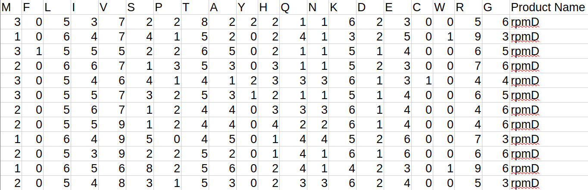
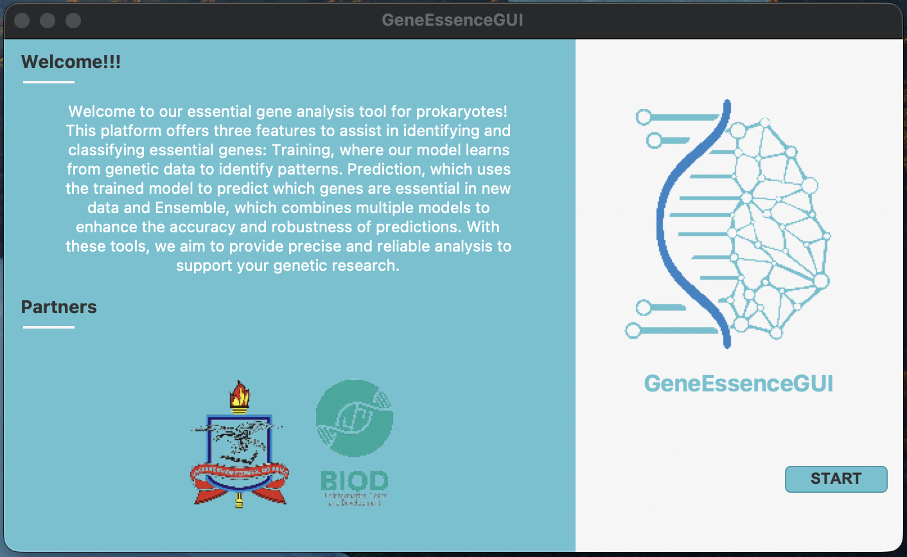
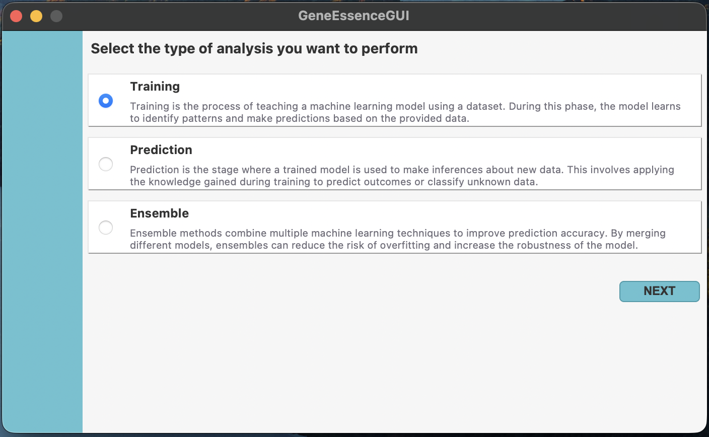
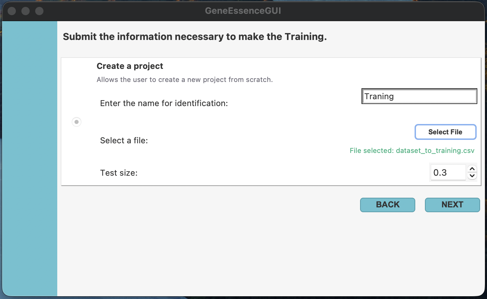
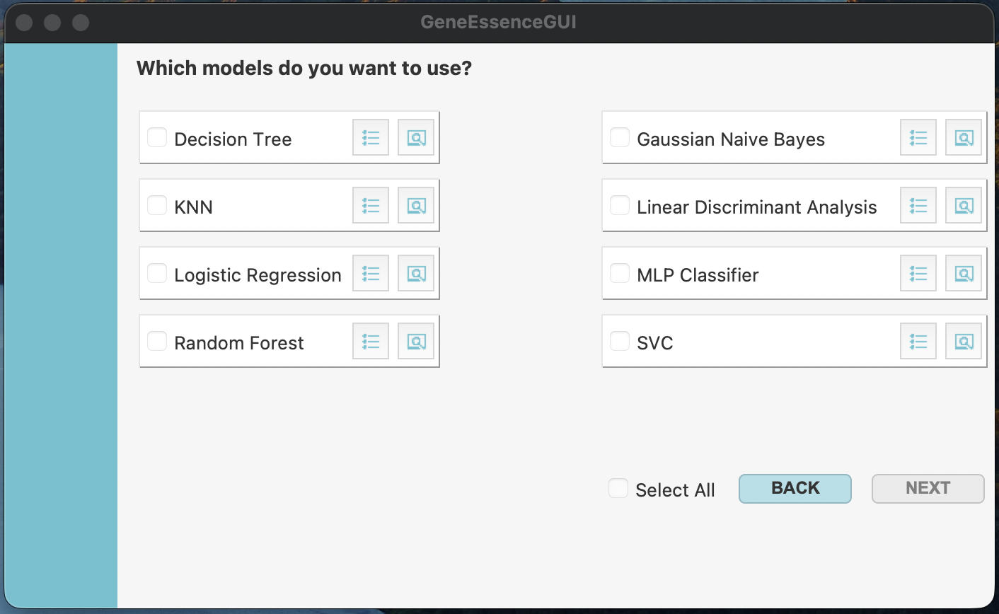

<p align="center">
  
</p>

# <p align="center">GeneEssenceGUI: A user-friendly Python-based GUI for essential gene classification using machine learning</p>

<p align="justify"> DNA sequencing technologies have led to significant advances in knowledge about genetic content, from microorganisms to humans. One important analysis is annotation, i.e., the inference of biological information from genome sequences, which enables researchers to understand the function of genetic products, such as genes, the basic units of heredity responsible for physical and heritable traits. Some genes perform vital functions, encoding proteins or RNAs that are essential for processes such as cell metabolism and are involved in crucial pathways, including glycolysis and the tricarboxylic acid cycle. Sequencing platforms now produce large data volumes, driving advances in omics and the development of computational methods to support analysis. More recently, artificial intelligence and machine learning have been applied to this data, with studies showing the effectiveness of biology-inspired approaches. These models do not require rule-based programming, though their creation still demands advanced programming and computer skills. This study presents GeneEssenceGUI, a user-friendly Python-based GUI for essential gene classification using machine learning, implementing nine models to classify essential genes. The platform supports seamless data ingestion, model orchestration, and hyperparameter optimization through a unified graphical environment. GeneEssenceGUI implements a persistent SQLite-based storage system that logs all experimental metadata, ensuring full computational reproducibility and audit trails for genomic studies.</p>

### Technology 
<image src="https://github.com/user-attachments/assets/3406d50a-a37b-4980-976f-61d0cf916957" alt="Image" width="50" />
<image src="https://github.com/user-attachments/assets/5b44250e-ced9-46a6-84dd-a4954f408495" alt="Image" width="50" />


### Compatible with
<image src="https://github.com/user-attachments/assets/97a4af37-07f2-4283-ae7d-9a1db3e51d50" alt="Image" width="50"/>
<image src="https://github.com/allanverasce/allanverasce/assets/25986290/3f178481-786d-4e6f-b46f-7e10732e9ca8" alt="Image" width="50"/>


# 1. Installation and User Guide 
<p align="justify">To run GeneEssenceGUI, you must install Python 3.12 or higher on your system. The installer can be obtained from the official website: Download Python.</p>

## 1.2. Installation of dependencies
### Windows Installation
1. Download the Python installer (python-12.x.x.exe) from the official website.
2. Run the installer and check "Add Python to PATH" before proceeding.
3. Click "Install Now" and wait for the installation to complete.
4. Verify the installation by opening the command Prompt and running: python --version

### Linux Installation (Ubuntu/Debian-based)
1. Update the package list: sudo apt update && sudo apt upgrade -y
2. Install Python using apt: sudo apt install python3
3. Verify the installation: python3 --version

### macOS Installation
1. Install Homebrew (if not already installed): /bin/bash -c "$(curl -fsSL https://raw.githubusercontent.com/Homebrew/install/HEAD/install.sh)"
3. Install Python using Homebrew: brew install python
4. Verify the installation: python3 --version

## 2. Running the software
<p>After downloading, follow the instructions according to your operating system: </p>

### Linux and macOS
- Grant execute permissions to the downloaded file:
``` 
chmod 777 GeneEssenceGUI
```

- For Linux: Double-click the file or run it in the terminal:

```
./GeneEssenceGUI
```

- For macOS: It is necessary to execute it through the terminal:

```
./GeneEssenceGUI
```
- Windows: Right-click on the executable and select "Run as administrator". This ensures the software has the necessary permissions to access system resources, preventing execution errors and enhancing compatibility with dependencies.

## 3. Dataset Model
<p align="justify">For GeneEssenceGUI to function correctly, the dataset must be in CSV (Comma-Separated Values) format. This format organizes data into rows and columns, each representing a data instance and containing a characteristic gene variable. To simplify data preparation, we provide a processing script that converts your files into the format the software accepts.</p>
<p align="center">

</p>

## 4. Main Window
<p align="justify">When you start running the software, the GeneEssenceGUI main window appears below. The window contains a welcome message and a brief description of the tool's main features, along with information about the partners involved in the project. To start using the software, click the "Start" button.</p>

<p align="center">

</p>

## 5. Analysis Type Selection Window
The next window shows the user the types of analysis available in the tool. At this stage, the user can choose between three analysis options, depending on their needs: training, prediction or ensemble.
- **Training:** During the training process, the machine learning model is trained using a data set. During this step, the model analyzes the data provided to identify patterns and learn how to make predictions based on them.
- **Prediction:** Prediction is the phase in which a previously trained model is used to analyze new data. Based on the knowledge acquired during training, the model concludes, in this case, the classification of essential genes in unknown data.
- **Ensemble:** Ensemble refers to an advanced technique in which multiple machine learning models are combined to improve the performance of the resulting model and thus the evaluation metrics. This approach reduces the risk of overfitting and makes the model more robust. By combining different analysis methods, a more reliable performance is ensured.

<p align="center">

</p>

### 5.1. Training: How to train the models?
<p align="justify"> On your first access, you will be shown a window for creating a new training project, in which you will have a field to provide the project's identification name and then select the tabular dataset file for training.
Finally, the user will be able to define the proportion of the dataset to be used for testing the models during this stage, the percentage of this dataset being set directly in the interface.</p>

<p align="center">

</p>

### 5.2. Model Selection Window
The next window allows the user to select the models to be trained. There are 8 types of models available, and the user can choose one or more of them.      

<p align="center">

</p>


Next to each model, there are two icons: the first opens the model parameters window, allowing the user to define each parameter or leave the default values (Figure 6); the second icon redirects the user to the model documentation, providing detailed information about it (Figure 7).


## Evaluation metrics selection window in training
The next window (Figure 8) will allow the user to select the evaluation metrics for the models chosen in the previous step. The available metrics for this process include Accuracy, Kappa, Precision, F1 Score, Matthews Corrcoef, and Recall.      

Additionally, next to each metric, there are two icons: the first displays the definition of the metric to assist the user in their choice (Figure 9). The second redirect to the official documentation provides detailed information about how it works (Figure 10).


## Results of the Receipt Method Selection Window in Training
After selecting the metrics, the user will need to click on the desired option to select the method for receiving the results (Figure 11). The available options are email delivery or local saving on the computer.


If the user chooses email delivery, a text field will display to enter the email address (Figure 12). If the option is to save locally, the user will need to select the directory where the results will be stored (Figure 13). After filling in the required field, simply click "Next" to confirm and proceed to the next step.

## Confirmation of Provided Information Window in Training
Before starting the analysis execution, the user will be asked to confirm the information provided during all previous steps (Figure 14). If everything is correct, simply click the confirmation button to begin the process.


## Project Execution Window in Training
After confirming the project information, the execution window will be displayed, showing details of the steps already completed, as well as the percentage of completion of the training process for the selected models (Figure 15).


Once the project execution process is complete, the user can view the full log of the process information. Additionally, the user can create a new project or view the results (Figure 16).


## Training Analysis Results
In the training analysis, the user will receive the trained models based on their selection, along with a graph showing the evaluation of the models' performance. In addition, a CSV file will be provided with the genes predicted for each model using the test dataset.

## Prediction: How to perform a prediction?
### Prediction Parameters Definition Window
If it is the user's first access, a window will appear to create a new project. At this stage, the user will have to provide a unique name to identify the project, as well as upload a CSV file containing the tabular data together with a previously trained model in PKL format to carry out the classification of the genetic products.

Note 2: GeneEssenceGUI provides a previously trained model that is available for use in the repository. This model is the result of grouping the eight models provided with the tool. If the user chooses to use this model, a feasibility test will be performed to verify whether the user’s hardware meets the minimum requirements to run it, which include at least 32 GB of RAM.

### After adding the initial parameters for the analysis, proceed by clicking "Next."
**Results of the Receipt Selection Window in Prediction**
In the next window, the user must select the method for receiving the results. The software offers two options:
- By Email (Figure 18), where the user provides the email address to which the results will be sent.
- In Local Folder (Figure 19), the user selects a directory to save the results.

### After choosing how to receive the results, advance to the next screen by clicking on "next".
**Information Confirmation Window in Prediction**
In the next step (Figure 20), all the provided information will be displayed for review. If everything is correct, simply click the Confirmation button to start the analysis.

During execution, it is possible to track the progress of the processing, as shown in the figure below.


At the end of the analysis (Figure 22), the results will be provided according to the option selected. In the same window, the user can view the results and start a new analysis if desired.


## Prediction Analysis Results
As a result of the prediction analysis, the user will receive a CSV file containing the predicted genes based on the model used.

## Load information from existing projects
If the user wants to analyze a project that has already been carried out, the tool offers the option of loading the information from a previous project, as long as it can be found in the database. Figure 32 illustrates the initial screen of the parameter definition stage for one of the analyses, where the data from the selected project is loaded automatically, allowing the user to continue working efficiently and without the need to restart the process.


## How to prepare your dataset
The generation and formatting of the data set, required as input for training and predicting the model, is carried out using the prepareDataset2RNA.jar module, the main parameters of which are listed in the image below.

1. To prepare the dataset for the essential gene prediction step, it is necessary to use the module with the “-p” parameter, see the execution example below:


   
2. To prepare the dataset that will be used to generate the models, it is necessary to provide the annotation files in CSV format and the amino acid sequences in FASTA format, both obtained from DEG, as well as the path to the organism files in GenBank format. See the example run below:


## Lab


