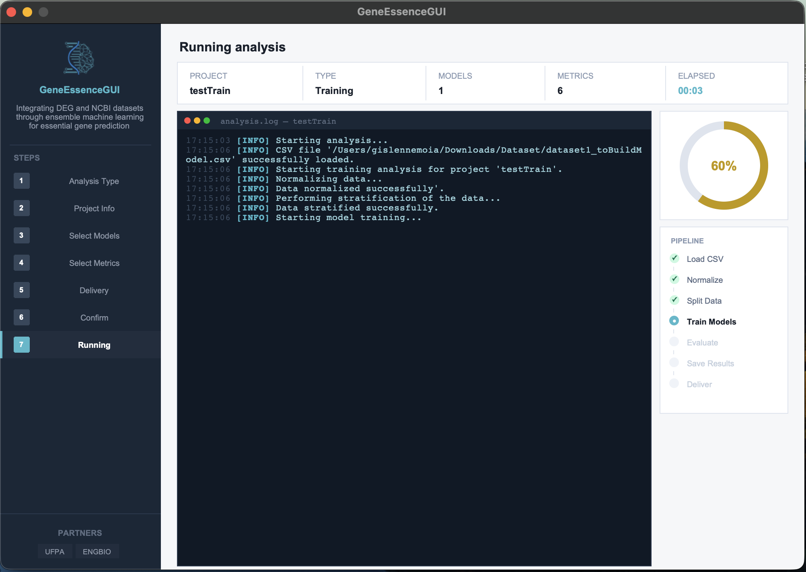
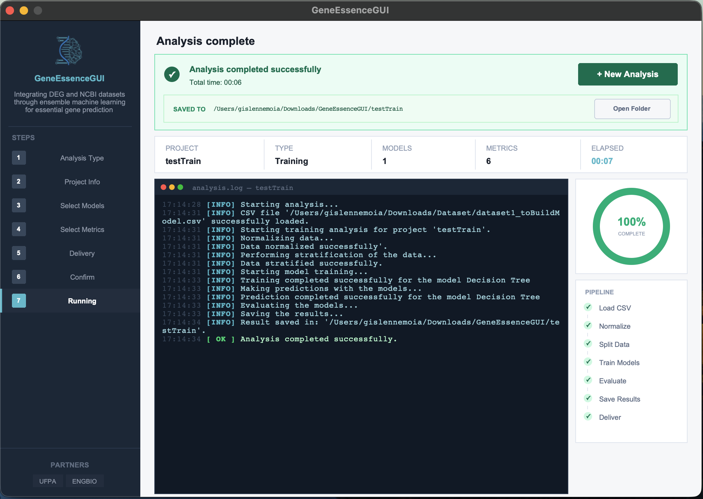

<p align="center">
  
</p>
<h1 align="center">GeneEssenceGUI</h1>

<p style="text-align: center;">Integrating DEG and NCBI datasets through ensemble machine learning for essential gene prediction</p>

<p style="text-align: center;">
  <a href="https://www.python.org"></a>
  
</p>

---

GeneEssenceGUI allows researchers to classify essential genes using machine learning without requiring programming skills. The platform handles data ingestion, model training, hyperparameter optimization, and result delivery through a unified wizard interface. All experimental metadata is logged to a local SQLite database for full reproducibility.

**Key features:**
- Nine machine learning classifiers (Logistic Regression, Random Forest, SVC, and more)
- Training, Prediction, and Ensemble analysis modes
- Integrated dataset preparation module — converts raw genomic files into the CSV format required for analysis
- Configurable hyperparameters per model
- Result delivery by email or local folder
---

## Table of Contents

- [1. Installation](#1-installation)
- [2. Main Window](#2-main-window)
- [3. Dataset Format](#3-dataset-format)
- [4. Prepare Dataset](#4-prepare-dataset)
- [5. Analysis Type Selection](#5-analysis-type-selection)
  - [5.1. Training](#51-training)
  - [5.2. Prediction](#52-prediction)
  - [5.3. Ensemble](#53-ensemble)
- [6. Loading Existing Projects](#6-loading-existing-projects)

---

# 1. Installation

Two installation methods are available: running via Docker or running from source.

## 1.1. Docker

The container receives your home directory via `-e HOST_HOME` and mounts it with `-v` so that file dialogs inside the application can browse your local files using the same paths.

### Linux
```bash
xhost +local:docker
docker run --rm \
  -e DISPLAY=$DISPLAY \
  -e HOST_HOME=$HOME \
  -v /tmp/.X11-unix:/tmp/.X11-unix \
  -v /home:/home \
  engbio/geneessencegui:v1.0
```

### macOS
Install [XQuartz](https://www.xquartz.org/) first, then:
```bash
xhost +localhost
docker run --rm \
  -e DISPLAY=host.docker.internal:0 \
  -e HOST_HOME=$HOME \
  -v /Users:/Users \
  engbio/geneessencegui:v1.0
```

### Windows

**Step 1 — Install VcXsrv**

Open PowerShell as Administrator and run:
```powershell
winget install marha.VcXsrv
```

**Step 2 — Configure and start XLaunch**

1. Open the Start menu and search for **XLaunch**.
2. Advance through the screens keeping the default options.
3. On the **Extra settings** screen, check **Disable access control**.
4. Finish the wizard. VcXsrv will run in the background (X icon in the system tray).

**Step 3 — Run the container**

With XLaunch running in the background, open PowerShell and run:
```powershell
docker run --rm `
  -e DISPLAY=host.docker.internal:0.0 `
  -e HOST_HOME=$env:USERPROFILE `
  -v "C:/Users:/home" `
  engbio/geneessencegui:v1.0
```

### Flag reference

| Flag | Description |
|------|-------------|
| `--rm` | Automatically removes the container when it exits |
| `-e DISPLAY` | Forwards the display to the X server (XQuartz on macOS, VcXsrv on Windows) so the GUI window opens on your machine |
| `-e HOST_HOME` | Passes your home directory path into the container so the application can resolve paths correctly |
| `-v /tmp/.X11-unix` | *(Linux only)* Shares the X11 socket for GUI rendering |
| `-v /home:/home` / `-v /Users:/Users` / `-v "C:/Users:/home"` | Mounts your users directory so file dialogs inside the app can browse local files using the same paths |

## 1.2. From source

Requires Python 3.12+ and Java (for the Prepare Dataset feature).

```bash
git clone https://github.com/allanverasce/geneessencegui.git
cd geneessencegui/GeneEssencelGUI
python -m venv .venv
```

Activate the virtual environment:

- **Windows:** `.venv\Scripts\activate`
- **Linux/macOS:** `source .venv/bin/activate`

Then install dependencies and run:

```bash
pip install -r requirements.txt
python GeneEssenceGUI.py
```

> **Note:** The **Receive by Email** delivery option is not available when running from source. The `.env` file containing the email credentials is not distributed with the repository. Use the **Save Locally** option instead.

---

# 2. Starting the Application

<p align="justify">When GeneEssenceGUI starts, the main window is displayed. The left sidebar shows the tool name, a brief description, a list of the four available features, and the project partners. The right panel presents two buttons to begin:</p>

- **START ANALYSIS** — opens the analysis wizard (Training, Prediction, or Ensemble).
- **PREPARE DATASET** — opens the integrated dataset preparation module.

<p style="text-align: center;">

</p>

**Note**: If your dataset is suitable, you can proceed directly to the [Analysis Type Selection](#5-analysis-type-selection)

---

# 3. Dataset Format

<p align="justify">GeneEssenceGUI requires datasets in CSV (Comma-Separated Values) format. Each row represents one gene instance. All columns except the last are treated as features; the <strong>last column must be the classification label</strong> (essential or non-essential).</p>

<p style="text-align: center;">

</p>

Sample datasets are provided in the `datasets/` folder of this repository.

## Sample Datasets

The `datasets/` folder contains ready-to-use files for each analysis mode:

| File | Instances | Use |
|------|-----------|-----|
| `dataset1_toBuildModel.csv` | 73,324 | Training |
| `dataset2_toBuildModel.csv` | 25,601 | Training |
| `dataset_toBuildEnsemble.csv` | 98,925 | Ensemble |
| `validation_to_prediction.csv` | 893 | Prediction (labeled) |
| `validation.csv` | 893 | Prediction (unlabeled) |

<p align="justify">All files share the same structure: **20 amino acid count features** (M, F, L, I, V, S, P, T, A, Y, H, Q, N, K, D, E, C, W, R, G) representing the residue composition of each gene product. In training and ensemble files the last column (`Product Name`) holds the gene product name sourced from the DEG database and serves as the classification label. Prediction files (`validation.csv`) omit this column since labels are unknown at inference time.</p>

### `datasets/prepareDatasets/`

This sub-folder contains the raw genomic input files needed to reproduce the sample datasets using the **Prepare Dataset** module:

| File | Description |
|------|-------------|
| `DEG10.aa` | Amino acid FASTA file downloaded from DEG |
| `deg_annotation_p.csv` | DEG annotation file (semicolon-separated, ≥ 13 columns) |
| `genbank.zip` | GenBank files (`.gb`/`.gbk`) for the target organism — extract before use |

---

# 4. Prepare Dataset

<p align="justify">The dataset preparation module is accessible directly from the main window via the <strong>PREPARE DATASET</strong> button. It uses the bundled <code>prepareDataset2RNA.jar</code> module to convert raw genomic files into the CSV format accepted by GeneEssenceGUI.</p>

Two preparation modes are available, each shown as a selectable card:

### Training Dataset

<p style="text-align: center;">

</p>

Generates labeled CSV files for model training. Requires three inputs:

- **DEG annotation file** (`.csv`) — annotation file obtained from the DEG database, with at least 13 semicolon-separated columns.
- **FASTA file** (`.fasta`, `.fa`, or `.aa`) — amino acid sequences obtained from DEG.
- **GenBank directory** — a folder containing organism files in GenBank format (`.gb` / `.gbk`).

### Prediction Dataset

Generates the input file for the Prediction analysis. Requires one input:

- **GenBank directory** — a folder containing organism files in GenBank format.

<p style="text-align: center;">

</p>

<p style="text-align: justify;">After filling in all required fields, clicking <strong>NEXT</strong> starts the preparation. The execution screen displays a real-time log (dataset.log) with color-coded output. When the process completes, a success banner appears with the total time and an <strong>Open Folder</strong> button pointing to the output directory. Clicking <strong>+ New Preparation</strong> returns to the mode selection screen.</p>

<p style="text-align: center;">

</p>

---

# 5. Analysis Type Selection

<p style="text-align: justify;">Clicking <strong>START ANALYSIS</strong> opens the type selection screen. A progress sidebar on the left tracks the current step of the wizard, updating dynamically based on the type chosen. Three analysis types are available:</p>

- **Training** — trains one or more machine learning models on a labeled dataset. The wizard includes steps for model selection, metric selection, and delivery configuration.
- **Prediction** — applies a previously trained model (`.pkl`) to new data and returns the classification of each gene. The wizard goes directly from project setup to delivery configuration.
- **Ensemble** — combines multiple pre-trained models using a hard-voting strategy. Requires a directory containing `.pkl` model files. The wizard includes a metric selection step.

<p style="text-align: center;">

</p>

---

# 5.1. Training

## 5.1.1. Project Information

<p style="text-align: justify;">After selecting <strong>Training</strong>, the Project Information screen is shown. The project name must be between 5 and 10 characters. The user selects the CSV dataset file and sets the proportion of data reserved for testing (test size), from 10% to 90%.</p>

<p style="text-align: justify;">If previous Training projects exist in the database, a toggle (<strong>Create new / Load existing</strong>) appears at the top. Selecting <em>Load existing</em> shows a list of saved projects whose settings are loaded automatically.</p>

<p style="text-align: center;">

</p>

## 5.1.2. Model Selection

<p style="text-align: justify;">The model selection screen displays the available classifiers in a two-column grid. At least one model must be selected to proceed. A <strong>Select All</strong> checkbox is available at the bottom of the screen.</p>

Each model card provides two action buttons:
- **⚙** (settings) — opens the parameter configuration modal for that model. This button is only enabled after the model is selected.
- **🔗** (link) — opens the official scikit-learn documentation for that model in the browser.

<p style="text-align: center;">

</p>

### Model Parameters

<p style="text-align: justify;">Clicking ⚙ on a selected model opens a modal window listing all configurable hyperparameters for that model. Parameters can be modified or left at their default values.</p>

<p style="text-align: center;">

</p>

## 5.1.3. Metric Selection

<p style="text-align: justify;">The metric selection screen lists the available evaluation metrics in a two-column grid. At least one metric must be selected. A <strong>Select All</strong> checkbox is available. The <strong>🔗</strong> button next to each metric opens its official documentation.</p>

<p style="text-align: center;">

</p>

## 5.1.4. Result Delivery

<p style="text-align: justify;">The delivery screen offers two options, each presented as a selectable card that expands to show its input:</p>

- **Receive by Email** — the results are compressed into a ZIP file and sent to the provided email address. A valid email format is required before proceeding.
- **Save Locally** — the user browses for a folder on their computer where the results will be saved.

<p style="text-align: center;">

</p>

## 5.1.5. Confirmation

<p style="text-align: justify;">Before execution, all configured parameters are displayed in a summary card for review: analysis type, project name, CSV file path, test size, selected models, selected metrics, and delivery method. Clicking <strong>CONFIRM AND RUN</strong> saves the project to the database and starts the analysis.</p>

<p style="text-align: center;">

</p>

## 5.1.6. Execution

<p style="text-align: justify;">The execution screen shows the analysis running in real time. It contains four areas:</p>

- **Info bar** (top) — displays project name, analysis type, number of models, number of metrics, and elapsed time.
- **Log terminal** (left) — a color-coded log with timestamps. Messages are tagged as `[INFO]`, `[ OK ]`, `[ERR]`, or `[WARN]`.
- **Progress ring** (right) — a circular progress indicator showing the current completion percentage.
- **Pipeline tracker** (right) — lists the execution steps (Load CSV → Normalize → Split Data → Train Models → Evaluate → Save Results → Deliver), highlighting the active step and marking completed ones with a checkmark.

<p style="text-align: center;">

</p>

<p style="text-align: justify;">When the analysis completes, a green success banner appears at the top with the total elapsed time. If the results were saved locally, the output path is shown along with an <strong>Open Folder</strong> button. A <strong>+ New Analysis</strong> button allows the user to start a new session.</p>

<p style="text-align: center;">

</p>

## 5.1.7. Training Results

<p style="text-align: justify;">The training analysis produces the following output files, organized into subfolders inside the project directory:</p>

- **Models/** — one `.pkl` file per trained model, ready for use in Prediction or Ensemble analyses.
- **Prediction/** — a CSV file with the gene classifications produced by each model on the test set.
- **Graphs/** — performance charts comparing the evaluation metrics across all trained models.

---

# 5.2. Prediction

> The ensemble learning model used for tool validation is available for download at the [v1.0.0 release page](https://github.com/allanverasce/geneessencegui/releases/tag/v1.0.0).

## 5.2.1. Project Information

<p style="text-align: justify;">After selecting <strong>Prediction</strong>, the Project Information screen requests a project name (5–10 characters), the CSV file with the data to be classified, and a previously trained model file in <code>.pkl</code> format.</p>

<p style="text-align: justify;">If the selected model file is large, a feasibility check is performed automatically to verify that the system has sufficient RAM to load it.</p>

<p style="text-align: center;">

</p>

## 5.2.2. Result Delivery, Confirmation, and Execution

<p style="text-align: justify;">The Delivery, Confirmation, and Execution screens follow the same structure as described in sections 5.1.4, 5.1.5, and 5.1.6. The pipeline tracker for Prediction shows the steps: Load CSV → Normalize → Predict → Save Results → Deliver.</p>

<p style="text-align: center;">

</p>

## 5.2.3. Prediction Results

The prediction analysis produces a CSV file containing the classification (essential / non-essential) for each gene in the input dataset.

---

# 5.3. Ensemble

## 5.3.1. Project Information

<p style="text-align: justify;">After selecting <strong>Ensemble</strong>, the Project Information screen requests a project name (5–10 characters), the CSV dataset for evaluation, a <strong>directory containing previously trained <code>.pkl</code> model files</strong>, and the test size proportion. The models in that directory are combined using a hard-voting strategy via scikit-learn's <code>VotingClassifier</code>.</p>

<p style="text-align: center;">

</p>

## 5.3.2. Metric Selection

<p style="text-align: justify;">The Ensemble wizard includes a metric selection step (same as Training, section 5.1.3) but skips individual model selection, since the models are loaded directly from the specified directory.</p>

## 5.3.3. Result Delivery, Confirmation, and Execution

<p style="text-align: justify;">The Delivery, Confirmation, and Execution screens follow the same structure as described in sections 5.1.4, 5.1.5, and 5.1.6. The pipeline tracker for Ensemble shows: Load CSV → Normalize → Split Data → Aggregate Models → Evaluate → Save Results → Deliver.</p>

<p style="text-align: center;">

</p>

## 5.3.4. Ensemble Results

The ensemble analysis produces:

- **Prediction/** — a CSV file with the hard-voting classification for each gene.
- **Graphs/** — performance charts for the ensemble evaluated against the selected metrics.

---

# 6. Loading Existing Projects

<p style="text-align: justify;">If projects of the same analysis type have been previously saved, the Project Information screen displays a segmented toggle at the top with two options: <strong>Create new</strong> and <strong>Load existing</strong>. Switching to <em>Load existing</em> shows a dropdown list of all saved projects for that type. Selecting a project loads all its previously configured parameters automatically, allowing the analysis to be re-run without re-entering information.</p>

<p style="text-align: center;">

</p>


## License

AGPL-3.0 license — see [LICENSE](LICENSE) for details.
